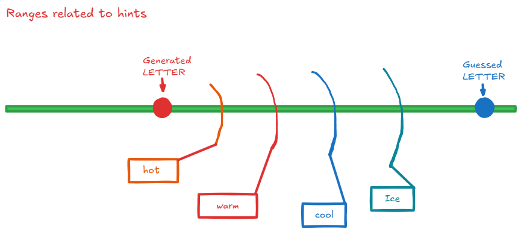
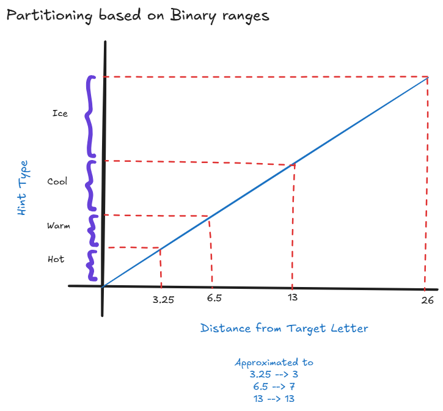
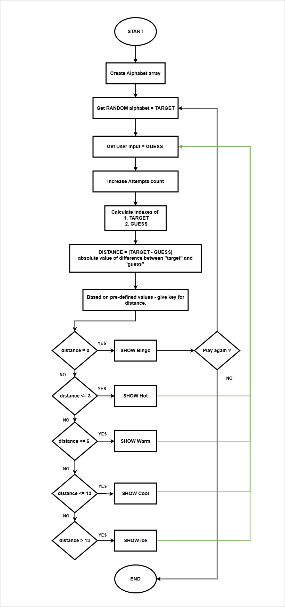

# Letter Guess Game

A simple game where you try to guess a secret letter from A to Z. With each attempt, the game provides "hot" or "cold" feedback to guide you to the correct answer.

## Live Demo

[**Click here to play the game!**](https://harish3000.github.io/guessing-game-algorithm/)

## Feedback Logic

The feedback system is designed using a logical approach inspired by the **Binary Search algorithm**. The range of possible letters is repeatedly halved to determine whether your guess is "Hot", "Warm", "Cool", or "Ice Cold".

## Algorithm Flow

JavaScript logic - flow for handling each guess:

